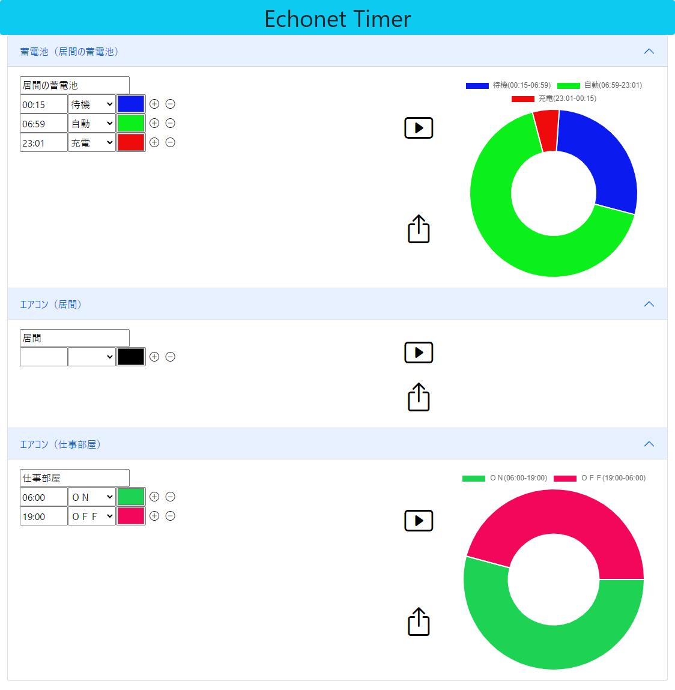
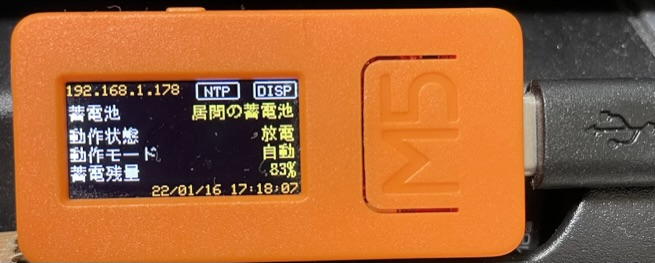

# EchonetTimer

## 概要

- EchonetLite 機器をタイマー制御するコントローラです。
- 現実装では、下記に対応しています。
  - エアコンの ON／OFF
  - 蓄電池の動作モード（自動、充電、放電、待機）
- タイマー設定はブラウザから行うことができます。
  - ▶ ボタンは、設定値をドーナツグラフに反映します。
  - アップロードボタンで、設定値を M5StickC に反映します。
    

## 装置外観



## 使用ライブラリ

- 以下は、platformio.ini で設定しているため、特に考慮する必要はありません。
  - LovyanGFX
  - EL_dev_arduino
  - NTPClient
  - ArduinoJson
  - M5StickC
- 以下は、html ソース上で CDN による参照を行っているため、特に考慮する必要はありません。（したがって、実行時はインターネット接続が必須です）
  - [jQuery](https://code.jquery.com/)
  - [Bootstrap](https://getbootstrap.jp/)
  - [Bootstrap Icons](https://icons.getbootstrap.com/)
  - [Chart.js](https://www.chartjs.org/)
- 以下は、別途ダウンロードとファイル配置が必要です。（ビルド手順に示します）
  - [ClockPicker](https://weareoutman.github.io/clockpicker/)

## コンフィギュレーション

- ビルドを行う前に、config.h の WIFI_SSID、WIFI_PASS 値を環境に合わせて書き換えて下さい。

## ビルド

1. ClockPicker をダウンロードし、展開する。
   - 使うのは、dist/bootstrap-clockpicker.min.js と dist/bootstrap-clockpicker.min.css の 2 ファイル。
1. 上記の 2 ファイルをそれぞれ、data/cp/clockpicker.min.js と data/cp/clockpicker.min.css としてコピーする。
1. ブラウザ用ファイル（data ディレクトリ配下）のアップロード
   - M5StickC の不揮発メモリ（SPIFFS）領域に書き込まれます。
   ```
   pio run --target uploadfs
   ```
1. コンパイル＆リンク＆アップロード
   - プログラムを M5StickC に書き込みます。
   ```
   pio run --target upload
   ```
